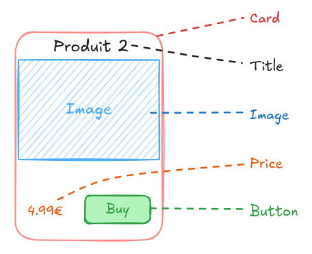
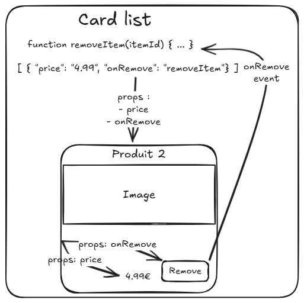

# 04 - Intéractions entre composants

---

## Structure

Un composant est souvent un regroupement de composants.



---

## Problème

On a besoin d'un mécanisme qui nous permette de faire passer des informations d'un composant père vers un composant fils, et parfois inversement.

---

## Flux de données - schéma



---

## Flux de données - règle

1. Les données vont toujours des parents vers les enfants, jamais dans le sens inverse. Cela se fait avec des propriétés (props).
2. L'enfant peut émettre un évènement (event) pour faire remonter une action ou un évènement vers un composant parent.

---

## Définition des props - côté composant

Liste les props utilisée

```javascript
// Person.js
export default {
  props: ["firstName", "birthDate", "lastName"],
  computed: {
    fullname() {
      return `${this.firstName} ${this.lastName}`;
    },
  },
  template: `<div>
        <h2>{{ fullname }}</h2>
        <p>{{ birthDate }}</p>
    </div>`,
};
```

---

## Définition des props - côté parent

```javascript
// List.js
import Person from './Person.js';

export default {
  components: { Person }
  data() { return {
    list: [{ firstName: "John", birthDate: "10/05/2000", lastName: "Doe" }],
  }},
  template: `
  <Person v-for="person in list"
    :firstName="person.firstName"
    :lastName="person.lastName"
    :birthDate="person.birthDate"
  />`
}
```

---

## Définition d'un évènement - côté composant

```javascript
// Counter
export default {
  props: ["text"],
  emits: ["onClick"],
  template: `<button @click="$emit('onClick')">{{ text }}</button>`,
};
```

---

## Définition d'un évènement - côté composant dans le script

```javascript
// ButtonAction
export default {
  props: ["text"],
  emits: ["onClick"],
  methods: {
    click(_event) {
      this.emit("onClick");
    },
  },
  template: `<button @click='click'>{{ text }}</button>`,
};
```

---

## Définition d'un évènement - côté parent

```javascript
// Counter
export default {
  components: { ButtonAction },
  data() {
    return { counter: 0 };
  },
  methods: {
    increment() {
      this.counter++;
    },
  },
  template: `<div>
        <p>{{ counter }}</p>
        <ButtonAction text="Click" @onClick="increment"/>
    </div>`,
};
```
